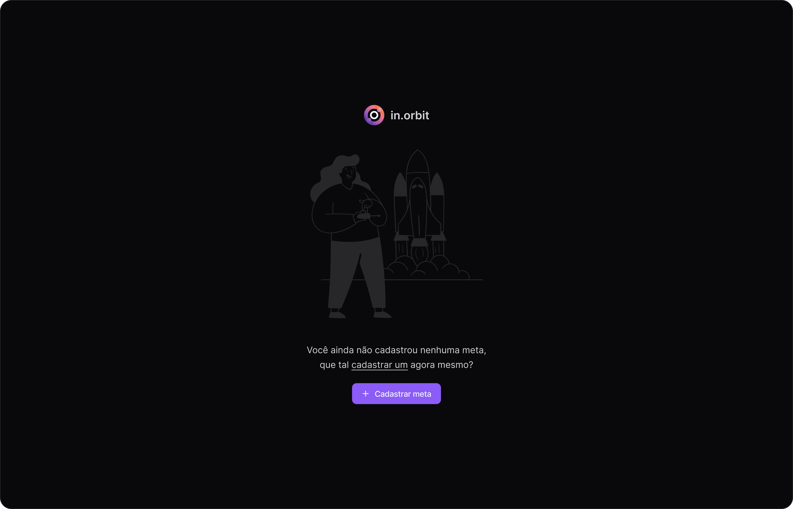
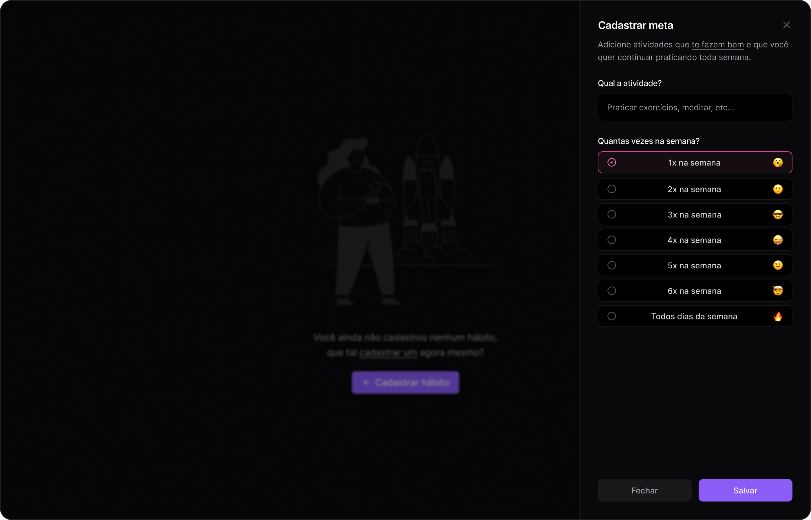
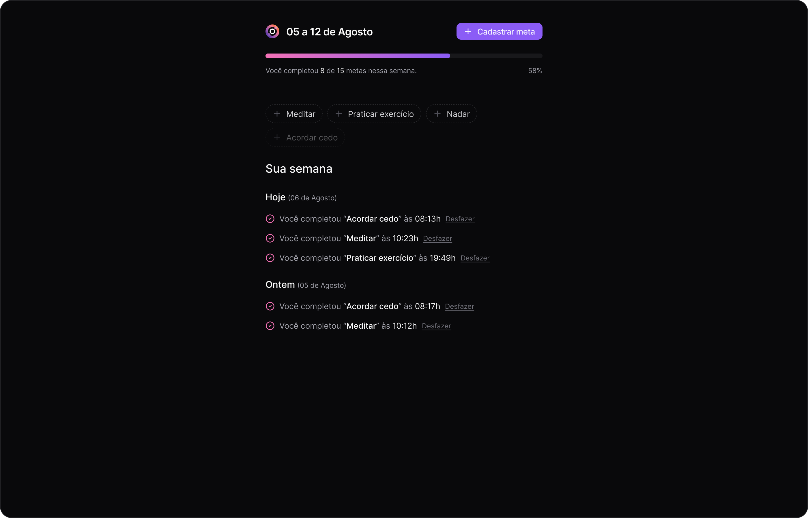

# Digital Pocket - Registro de Metas

Bem-vindo ao **Digital Pocket**, um site desktop para registrar metas e acompanhar seu progresso semanal. O projeto foi desenvolvido em React com Fastify para o backend, com uma estrutura de monorepo para o frontend e backend.

## Imagens do Projeto

### Tela Inicial (Sem Metas)



### Criando uma Meta



### Metas Criadas



## Figma

As telas do projeto estão disponíveis no [Figma](./docs/Digital%20Pocket%20•%20in.orbit.fig).

## Tecnologias

- **Frontend**: React, Vite, TailwindCSS, React Hook Form, Radix UI.
- **Backend**: Fastify, Drizzle ORM, Zod, PostgreSQL.

## Estrutura do Projeto

Este projeto é organizado como um monorepo, utilizando workspaces para dividir o frontend e o backend. Abaixo está a estrutura básica do projeto:

```
digital-pocket/
├── packages/
│   ├── backend/
│   └── frontend/
├── node_modules/
├── package.json
└── README.md
```

## Instalação

### Requisitos

- **Node.js** >= 20
- **PostgreSQL** >= 13
- **npm** >= 8

### Instalar Dependências

Para instalar as dependências do monorepo, execute o seguinte comando na raiz do projeto:

```bash
npm install
```

### Rodando o projeto

Para rodar o frontend e o backend juntos em ambiente de desenvolvimento, use:

```bash
npm run dev
```

Isso rodará o frontend e o backend simultaneamente usando `concurrently`.

---

Para detalhes mais específicos sobre cada parte do projeto, veja os readmes dentro de cada pacote:

- [Frontend README](./packages/frontend/README.md)
- [Backend README](./packages/backend/README.md)